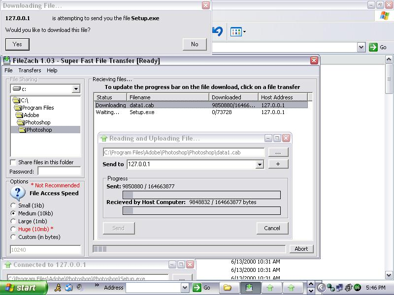



## FileZach \- Winsock Transfer Application

### Description

FileZach is a perfomance driven application which uses the Winsock control to send and recieve files from one computer to another. While not exactly 'super fast' (as its brother FileZap), it is much faster than tradditional email/im clients. To start off, you can choose 5 basic upload/input speeds. The first one, small, will open the file in binary mode, and input 1024 bytes (1kb) and send it to the remote user. There is then Medium (10kb), Large (1mb) and Huge(10mb). Due to perfomance issues with your computer, I recommend you select 'Medium' first, then if your pc can handle it 'Large'. Huge on my own development computer (Celeron1.5/128ram) caused crashes and freezes with the application and windows. For your convieniance, you can monitor two upload speeds, wherein most apps only have one. The *Sent* progressbar monitors how much data you have sent via winsock to the remote host. The *Recieved* progressbar monitors how much data the remote host has recieved and written to disk. While using larger input speeds, keep in mind that if the remote host computer is much slower than yours, you may see that the upload bar is much farther than the recieved one. You can monitor all downloading files on the listview on the main form, and click on an item to see its progress. If you do not want to recieve any files, goto File --> Disable, and the winsocks will stop listening for connections. IF you would like to send a file goto File --> Send, or if you would like to cancel all downloads, goto File --> Disconnect all. I look forward to hearing your feedback and/or votes, please report any bugs you find in this application. If I get enough response, I'll start working on FileZach Plus+, which will have File Sharing, operate as a download manager for internet explorer, will include compression/encryption and also UserToUser chat while files are being transfered.
 
### More Info
 

             |
---                |---
**Submitted On**   |2004-04-13 09:29:06
**By**             |[Xomni Networks](https://github.com/Planet-Source-Code/PSCIndex/blob/master/ByAuthor/xomni-networks.md)
**Level**          |Intermediate
**User Rating**    |4.8 (43 globes from 9 users)
**Compatibility**  |VB 5\.0, VB 6\.0
**Category**       |[Internet/ HTML](https://github.com/Planet-Source-Code/PSCIndex/blob/master/ByCategory/internet-html__1-34.md)
**World**          |[Visual Basic](https://github.com/Planet-Source-Code/PSCIndex/blob/master/ByWorld/visual-basic.md)
**Archive File**   |[FileZach\_\-1732944132004\.zip](https://github.com/Planet-Source-Code/xomni-networks-filezach-winsock-transfer-application__1-53120/archive/master.zip)

